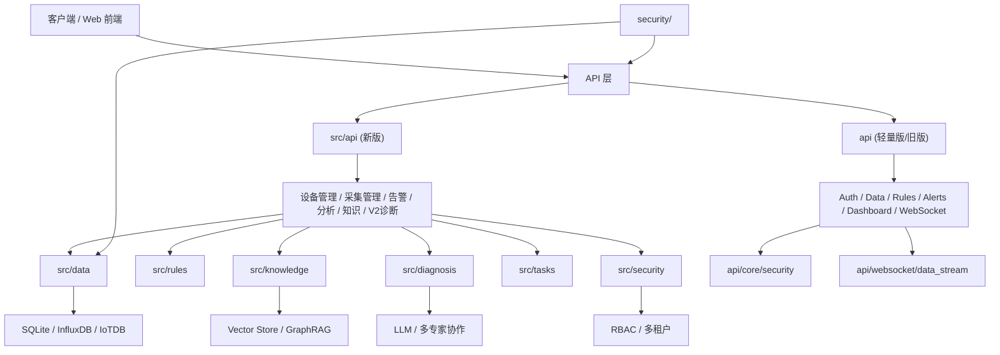

# Miaota Industrial Agent 后端代码分析说明

## 1. 文档目的

本文从后端全栈工程师视角，对仓库中的后端代码做一次“结构梳理 + 工程评估 + 可运行性检查”。

重点回答 4 个问题：

1. 当前后端由哪些模块组成。
2. 实际的数据流、接口流和依赖关系是什么。
3. 哪些代码已经具备雏形，哪些仍是演示版或未接通状态。
4. 如果继续推进为可交付后端，下一步应该怎么收敛。

---

## 2. 总体结论

这个仓库的后端代码量不少，覆盖了工业采集、规则引擎、告警、知识库、RAG、多智能体诊断、权限、多租户、审计、迁移、健康检查等完整后端能力版图，但当前实现呈现出明显的“双后端栈并存 + 领域代码较完整 + API 装配层未收敛”的特征。

简单说：

- `src/` 更像主业务域层，能力最全，包含数据、规则、知识、诊断、安全、任务、工具等。
- `src/api/` 试图把这些能力包装成新版 API，但接线不完整，部分文件不能直接运行。
- `api/` 是另一套较轻量的 FastAPI 壳层，包含 JWT、WebSocket 和一批 REST 路由，但大部分接口仍是 mock/TODO。
- `security/` 和 `migrations/` 是横切能力模块，独立度较高，代码思路较清晰。

因此，当前仓库更接近“功能原型集合 + 中后期架构草案”，还不是一套已经完全收敛、能直接稳定上线的单一后端实现。

---

## 3. 后端目录地图

### 3.1 主目录分层

| 目录 | 角色 | 结论 |
|---|---|---|
| `src/api/` | 新版 API 层 | 功能最丰富，但装配问题最多 |
| `api/` | 旧版/轻量 API 层 | 可读性高，但多为演示接口 |
| `src/data/` | 采集、缓存、存储 | 后端基础设施核心 |
| `src/rules/` | 规则解析与执行 | 工业监控场景核心 |
| `src/knowledge/` | 文档加载、切块、向量库、GraphRAG | 知识增强诊断能力核心 |
| `src/diagnosis/` | 多智能体诊断 | 诊断能力核心 |
| `src/agents/` | CAMEL 社会化协作 | 高阶智能体扩展 |
| `src/security/` | RBAC、多租户 | 主业务安全模型 |
| `security/` | 输入校验、审计、合规 | 横切安全治理模块 |
| `src/tasks/` | 异步长任务跟踪 | 诊断异步化基础 |
| `src/utils/` | 线程安全、日志、连接池、健康检查等 | 通用基础设施 |
| `migrations/` | SQLite 迁移管理 | 数据结构演进能力 |

### 3.2 运行入口

仓库里有 3 个入口概念：

1. `start.py`
   - 目标是以脚本模式启动采集、规则处理和完整系统。
   - 当前依赖 `src.core` 暴露的对象，但 `src.core` 本身装配有问题，不能稳定运行。

2. `src/api/main.py`
   - 目标是新版统一 API 入口。
   - 设计上更像未来主入口。
   - 目前存在语法错误和依赖装配问题。

3. `api/main.py`
   - 目标是另一套 FastAPI 服务入口。
   - WebSocket、JWT、dashboard、data、rules 等接口都挂在这里。
   - 可编译，但大量接口仍是 mock 或 TODO。

---

## 4. 推荐理解方式

如果从“后端系统分层”看这份代码，推荐按下面方式理解：



---

## 5. 关键模块分析

## 5.1 API 层

### `src/api/`

这是仓库里最像“未来主后端”的 API 层。

已覆盖的能力：

- 健康检查：`health.py`
- 设备管理：`devices.py`
- 采集管理与数据查询：`collection.py`
- 告警管理：`alerts.py`
- 分析：`analysis.py`
- 知识检索与诊断：`knowledge.py`
- V2 多智能体诊断：`diagnosis_v2.py`
- 认证与租户依赖：`dependencies.py`

优点：

- 路由职责分拆较清晰。
- 模型定义基本使用 Pydantic。
- 业务模块边界明确。
- 已考虑权限校验、多租户、长任务跟踪。

现实状态：

- 很多路由仍然使用内存字典或模拟数据。
- 尚未真正接入 `src/data/storage.py`、`src/data/collector.py`、`src/security/rbac.py` 等底层模块。
- 部分路由和依赖层存在名称、接口、字段不一致的问题。

### `api/`

这套 API 比较像第一版后端网关或 demo 服务。

已覆盖的能力：

- `api/main.py` 统一挂载路由和 WebSocket
- `api/core/security.py` 提供 JWT 认证
- `api/websocket/data_stream.py` 管理实时推送
- `api/routers/*.py` 提供 data、rules、alerts、dashboard、diagnosis、auth 等接口

优点：

- 结构完整，能表达一个标准 FastAPI 服务的骨架。
- 生命周期、CORS、GZip、异常处理、WebSocket 都考虑到了。

现实状态：

- 多数路由返回的是静态值或模拟值。
- `startup_event()` / `shutdown_event()` 还是 TODO。
- 安全和业务没有与 `src/` 的能力层统一。

### API 层结论

两套 API 栈都存在，但没有完成统一：

- `src/api/` 更先进、更贴近真实业务。
- `api/` 更稳定地表达了“服务壳”。
- 当前不建议同时长期维护两套，应明确主栈。

---

## 5.2 数据采集与存储

### `src/data/collector.py`

职责：

- 支持 Siemens S7 和 Modbus TCP 两类采集。
- 负责 PLC 连接、标签读取、连续采集、自动重连。

优点：

- 已考虑连接失败、重试、循环采集。
- 有面向工业场景的地址解析。
- 与线程安全组件有结合意图。

问题：

- 内部同时使用 `self.client`、`self.is_connected` 和 `self._client_guard`，状态源不统一。
- `ConnectionGuard` 没有被真正用作连接创建入口。
- 对 S7 float/int 解析比较粗糙，工业协议细节还不够稳健。
- 启动脚本调用的方法名与该类实际方法名不一致。

### `src/data/buffer.py`

职责：

- 本地 SQLite 缓存
- 断线补传
- 批量刷盘
- 网络状态切换

优点：

- 这是仓库里完成度较高的后端基础设施模块之一。
- 同时考虑了输入校验、连接池、批处理、重试计数、溢出清理。
- 适合工业场景的“边采边缓冲”模型。

问题：

- `_flush_buffer()` 期望 `storage_backend.write_batch()` 返回 `(success, failed)`，但 `src/data/storage.py` 的实现返回 `int`，接口协议不一致。

### `src/data/storage.py`

职责：

- 定义统一时序存储抽象 `TimeSeriesStorage`
- 提供 InfluxDB / IoTDB / SQLite 三种实现
- 通过 `StorageManager` 做后端选择

优点：

- 抽象层思路对，适合后续扩展更多 TSDB。
- 三种实现覆盖了开发、测试和生产导向场景。

问题：

- 接口是 `async` 风格，但部分后端内部仍是同步调用，异步边界不够统一。
- 现有测试文件与这里的真实 API 已不匹配。

### 数据层结论

数据层设计是这份仓库里最有“工程骨架感”的部分，尤其是 `buffer.py`、`storage.py`、`collector.py` 的拆分思路是对的，但目前仍停留在“模块可看、系统未完全串起来”的阶段。

---

## 5.3 规则引擎

### `src/rules/rule_parser.py`

职责：

- 解析 JSON 规则文件
- 将 DSL 条件编译为 Python 可执行函数

支持能力：

- threshold
- duration
- rate_of_change
- logic
- correlation_violation

优点：

- 规则 DSL 结构清晰。
- 将“规则定义”和“规则执行”分开是正确做法。

问题：

- parser 期望 `logic` 条件使用 `logic` 字段，但测试里传的是 `operator`。
- rate-of-change 实现读取 `change_threshold`，测试里传的是 `min_change`。
- 因此规则引擎与测试样例已经发生漂移。

### `src/rules/rule_engine.py`

职责：

- 加载规则
- 编译规则
- 评估实时数据
- 生成告警
- 做抑制窗口控制

优点：

- 已考虑 suppression 防止告警风暴。
- 支持回调扩展。
- 有持续评估线程模型。

问题：

- 示例代码调用 `register_alert_callback()`，而真实方法名是 `add_alert_callback()`。
- 没有持久化活动告警列表。
- 与 API 告警模块没有统一数据结构。

### 规则层结论

规则引擎的抽象方向是正确的，适合作为工业监控系统核心，但当前 DSL、测试、API 三者没有完全对齐。

---

## 5.4 知识库、RAG 与诊断

### `src/knowledge/`

包含：

- `document_loader.py` 文档加载
- `document_chunker.py` 切块
- `vector_store.py` 向量库抽象
- `rag_engine.py` RAG 封装
- `graph_rag.py` 图谱与 GraphRAG

特点：

- 这部分体现了“工业知识库 + 智能诊断增强”的明显产品方向。
- `GraphRAG` 已具备实体、关系、路径推理、子图查询等概念模型。
- 当前内置的是示例工业知识图谱，不是生产知识抽取流水线。

### `src/diagnosis/multi_agent_diagnosis.py`

职责：

- 模拟多个专家代理协同诊断
- 聚合专家意见
- 形成最终结论、行动建议、备件清单、模拟场景

优点：

- 这是仓库里业务表达最完整、最贴近产品卖点的模块。
- 专家分工明确：机械、电气、工艺、传感器、历史案例、协调者。
- 输出结构丰富，适合直接服务前端报告页。

问题：

- 当前 LLM 调用仍是 mock 响应。
- 专家结果没有真正与知识库、设备历史、规则结果形成统一上下文。

### `src/agents/camel_integration.py`

职责：

- 提供 CAMEL 社会化协作代理框架
- 面向更复杂任务协作

结论：

- 更偏未来扩展方向。
- 对主业务闭环还没有形成必要依赖。

### 智能诊断层结论

这部分是仓库最强的“概念验证区”。如果项目目标是工业智能诊断平台，这一层的产品方向非常清楚，但目前还主要是演示级推理与结构化输出，不是实际在线诊断引擎。

---

## 5.5 安全、权限与租户

### `src/security/rbac.py`

职责：

- 定义权限枚举
- 角色、用户建模
- 用户与角色授权
- 权限检查

优点：

- 边界清楚。
- 权限设计粒度合理。
- 面向 B 端工业系统是合适的。

现实状态：

- API 层没有完整接入这套 RBAC 管理器。

### `src/security/multitenancy.py`

职责：

- 租户模型
- 租户配额
- 使用量统计
- 状态切换
- 租户隔离辅助

优点：

- 多租户模型设计完整。
- 很适合 SaaS 化工业平台。

现实状态：

- 与真实数据库、真实用户体系尚未闭环。

### `security/input_validator.py`

职责：

- 对 measurement、tags、fields、timestamp、JSON、IP 等做输入校验。

优点：

- 是很实用的安全基础设施。
- 已考虑注入、XSS、危险字符、限流。

### `security/audit.py`

职责：

- 审计日志记录
- 哈希链防篡改
- 查询与报表

优点：

- 从工程思路看很好，适合工业合规场景。

问题：

- `log()` 里哈希生成和 `verify_integrity()` 的重算逻辑并不完全一致，存在校验失败风险。

### `security/compliance.py`

职责：

- 输出等保 2.0 / GDPR 风格合规检查报告

结论：

- 更偏“治理文档自动化”能力，不是业务主链路代码。
- 对售前、审计、交付文档有价值。

---

## 5.6 任务、工具与运维基础设施

### `src/tasks/task_tracker.py`

职责：

- 跟踪异步任务
- 进度更新
- 超时控制
- 统计

适用场景：

- 多智能体诊断
- 大批量分析
- 后台导出任务

评价：

- 设计较完整，适合作为长任务框架雏形。

### `src/utils/`

主要包括：

- `thread_safe.py` 线程安全容器、连接守护、熔断器
- `connection_pool.py` SQLite 连接池
- `structured_logging.py` 结构化日志
- `health_check.py` 健康检查
- `graceful_shutdown.py` 优雅停机
- `error_handler.py` 错误分类与包装

评价：

- 这部分“工具层”整体比 API 装配层更成熟。
- 很明显是按后端工程化思维来写的。

---

## 5.7 迁移与数据库演进

### `migrations/migration_manager.py`

职责：

- 管理 SQLite schema migrations
- 支持 init/status/migrate/create/rollback/verify

优点：

- 对小型项目或单机边缘场景足够实用。
- 已提供初始化迁移模板。

现实状态：

- 与 API 持久层尚未真正打通。
- 更多是“准备好了框架”，不是“已经被主链路依赖”。

---

## 6. 当前真实数据流

从代码意图看，完整数据流应该是：

1. PLC 采集器读取现场数据。
2. TagMapper 将地址语义化。
3. DataBuffer 本地缓存数据。
4. StorageManager 写入 InfluxDB/IoTDB/SQLite。
5. RuleEngine 对实时数据做规则评估。
6. Alert 模块管理告警。
7. Analysis/Knowledge/Diagnosis 模块做分析与诊断。
8. API 层将结果暴露给前端，并通过 WebSocket 推送实时更新。

但从当前实际接线状态看，真正跑通的更多是“局部能力”，不是完整主链路：

- 采集、缓存、存储是相对完整的基础模块。
- API 层与基础模块未完全直连。
- 多智能体诊断与知识图谱主要靠内置示例数据和 mock 输出。
- 双 API 栈没有统一。

---

## 7. 可运行性检查结果

本次做了两类快速检查：

### 7.1 代码编译检查

执行：

```bash
python -m compileall src api security migrations
```

结果：

- 大部分文件可编译。
- `src/api/main.py` 存在明确语法错误，导致新版 API 入口不能直接启动。

### 7.2 测试检查

执行：

```bash
python -m pytest -q
```

结果：

- 测试在 collection 阶段就失败。
- 当前环境缺少 `loguru` 依赖，导致多个测试无法导入模块。
- 即便补齐依赖，测试代码与现有实现也有明显漂移。

---

## 8. 主要工程问题清单

下面是本次分析里最关键的一批问题。

| 类别 | 问题 | 影响 |
|---|---|---|
| 架构 | `src/api/` 与 `api/` 两套后端栈并存 | 维护成本高，职责混乱 |
| 入口 | `src/api/main.py` 有语法错误 | 新版 API 无法启动 |
| 入口 | `start.py` 依赖的 `src.core` 导出不成立 | 启动脚本无法稳定运行 |
| 装配 | `src/api/dependencies.py` 引用不存在的 `src.config.config_manager` 和不存在的 `connection_pool` 对象 | 认证/依赖注入层运行失败 |
| 路由 | `src/api/routers/health.py` 调用不存在的 `check_all()`，并读取不存在的 `response_time` 字段 | 健康检查接口运行失败 |
| 路由 | `src/api/routers/knowledge.py` 使用 `HTTPException` 但未导入 | 文档详情接口在异常分支报错 |
| 路由 | `api/routers/auth.py` 使用 `Depends` 但未导入 | 路由模块导入失败 |
| 数据 | `DataBuffer` 假设 `write_batch()` 返回 `(success, failed)`，但存储层返回 `int` | 断线补传流程无法正常工作 |
| 采集 | `PLCCollector` 的连接状态管理不统一 | 连接状态可能失真 |
| 规则 | `RuleParser`、`RuleEngine` 与测试样例的字段约定不一致 | 规则测试失真，功能可信度下降 |
| 测试 | 测试代码引用大量不存在的方法和类 | 测试集不能真实反映质量 |
| 持久化 | 多数 API 路由仍是内存存储或模拟数据 | 无法支撑真实生产数据 |

---

## 9. 典型问题定位

以下几处最值得优先修：

1. 新版 API 入口语法错误  
   文件：`src/api/main.py`

2. 启动脚本与核心导出不匹配  
   文件：`start.py`、`src/core/__init__.py`

3. 依赖注入层引用了不存在的配置模块和连接池对象  
   文件：`src/api/dependencies.py`

4. 健康检查路由与健康检查实现接口不一致  
   文件：`src/api/routers/health.py`、`src/utils/health_check.py`

5. 缓冲层与存储层批量写入返回值契约不一致  
   文件：`src/data/buffer.py`、`src/data/storage.py`

6. 测试集与现有实现严重漂移  
   文件：`tests/unit/test_storage.py`、`tests/integration/test_data_flow.py`

---

## 10. 现有测试与代码的一致性评估

当前测试集并不能视为“真实可用”的质量保障，原因有三类：

### 10.1 测试依赖环境未准备好

- 当前运行环境缺少 `loguru`。
- 因此许多模块在测试收集阶段就失败。

### 10.2 测试接口与现有实现脱节

示例：

- 测试引用 `TagMappingManager`，实际代码只有 `TagMapper`
- 测试引用 `DataStorageManager`，实际代码只有 `StorageManager`
- 测试调用 `SQLiteStorage.write_async/query_async/_ensure_table`，实际实现没有这些方法
- 测试调用 `RuleEngine.add_rule()`，实际实现没有该方法

### 10.3 测试设计基于旧接口假设

这说明仓库至少经历过一轮较大的重构，但测试没有同步更新。

结论：

- 当前测试集更像历史遗留测试草稿。
- 在继续开发前，建议先做一次“测试接口对齐”。

---

## 11. 后端成熟度判断

如果按后端成熟度来打分，我会这样看：

### 已经具备较好雏形的部分

- 数据缓冲与连接池
- 存储抽象
- 规则解析与执行框架
- RBAC / 多租户模型
- 审计 / 合规模块
- 多智能体诊断的输出结构设计

### 仍停留在演示或草案阶段的部分

- 统一 API 装配
- 真实数据库落地
- 真实身份系统
- 真实 WebSocket 数据总线
- LLM / GraphRAG 与主业务数据打通
- 测试体系

### 综合判断

这是一个“业务野心很完整，工程收敛还差最后一大步”的后端仓库。

它不是一个空壳项目，也不是只写了文档的 PPT 工程；但它还没有进入“单一入口、单一依赖、单一数据契约”的稳定后端阶段。

---

## 12. 建议的收敛路线

如果要把它推进成可持续开发的后端，我建议按下面顺序做：

### 第一阶段：先统一主栈

- 明确以 `src/api/` 为主，还是以 `api/` 为主。
- 删除或冻结另一套 API。
- 修复 `src/api/main.py` 语法问题。
- 修复 `start.py` 和 `src/core/__init__.py` 的导出问题。

### 第二阶段：统一接口契约

- 统一 `collector` / `buffer` / `storage` 的方法签名。
- 统一 `rule_parser` / `rule_engine` / `tests` 的 DSL 字段。
- 统一告警对象结构。
- 统一异步和同步边界。

### 第三阶段：把 mock 替换为真实集成

- 设备管理接 SQLite 元数据表
- 数据查询接时序库
- 告警接持久化表
- 诊断结果接历史记录表
- WebSocket 接真实采集流或事件总线

### 第四阶段：重建测试体系

- 先修单元测试
- 再补集成测试
- 最后补 API 契约测试和负载测试

### 第五阶段：补生产化能力

- 认证黑名单/刷新机制
- 配置中心
- 结构化日志落库或接 ELK/Loki
- 监控告警
- 容器化部署验证

---

## 13. 推荐的目标架构

最终建议收敛为下面这种单后端结构：

```text
src/
  api/              # 唯一 API 入口
  services/         # 业务服务层（可从现有 diagnosis/knowledge/rules/data 中抽）
  repositories/     # 元数据和持久化访问层
  domain/           # 领域模型
  integrations/     # PLC、TSDB、LLM、Neo4j、Redis 等
  security/         # RBAC、多租户、审计
  utils/            # 通用工具
tests/
```

这会比当前 `api/ + src/api/ + src/domain modules` 的双轨结构更容易维护。

---

## 14. 给接手开发者的说明

如果你是下一位接手该仓库的后端工程师，建议按下面顺序阅读代码：

1. `src/data/buffer.py`
2. `src/data/storage.py`
3. `src/rules/rule_parser.py`
4. `src/rules/rule_engine.py`
5. `src/diagnosis/multi_agent_diagnosis.py`
6. `src/knowledge/graph_rag.py`
7. `src/security/rbac.py`
8. `src/security/multitenancy.py`
9. `src/api/routers/*.py`
10. `src/api/dependencies.py`
11. `src/api/main.py`

这样可以先理解业务能力，再看 API 是怎么想要把它们拼起来的。

---

## 15. 本次分析结论摘要

从后端全栈工程师视角，这个项目的价值主要在两个方面：

- 业务方向清晰：工业采集 + 规则监控 + 智能诊断 + 知识增强
- 模块拆分合理：数据、规则、知识、安全、任务这些边界已经具备雏形

当前最大的问题不是“没有功能”，而是“功能很多，但主链路没有收敛成一条可稳定运行的后端”。

所以后续工作的核心不应该再是继续平铺新能力，而应该是：

- 统一主入口
- 统一数据契约
- 统一依赖关系
- 把 mock 逐步换成真实存储与真实集成
- 重建测试

做到这一步，这个仓库才会从“能力展示型项目”进入“可持续演进型后端工程”。
